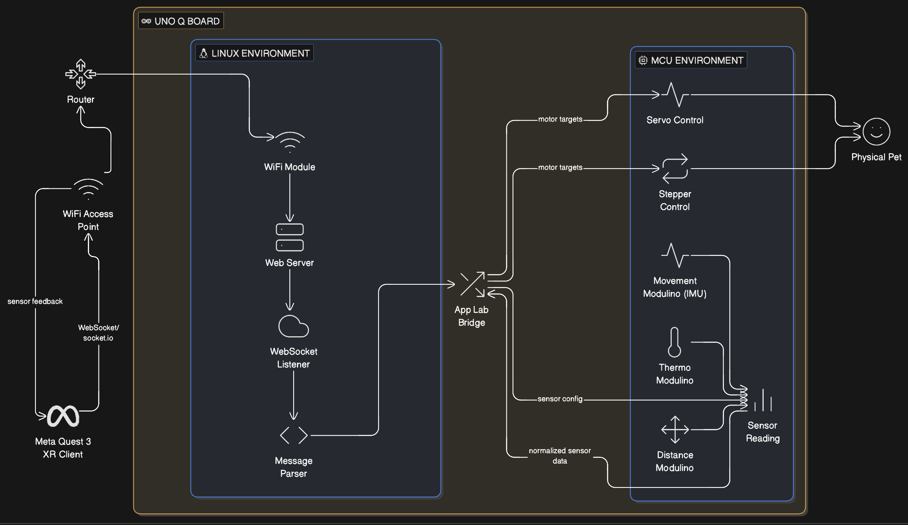

# Power Pet - A Tangible VR Companion for Focus, Calm, and Emotional Regulation
Submission for MIT Reality Hack 2026

Power Pet is a tangible XR companion that synchronizes a virtual pet in WebXR with a physical robotic pet using Arduino Uno Q. The system combines browser-based XR, Linux networking, and real-time microcontroller motor control to create a multi-sensory, accessible experience for emotional regulation and productivity.

## System Architecture

Power Pet runs on a **hybrid architecture**:

- WebXR (Meta Quest 3) for interaction and hand tracking (doesn't require users to download apps and allows for fast testing)
- Linux (Arduino Uno Q) for networking and WebSockets
- MCU (Arduino Uno Q) for real-time motor + sensor control
- Physical hardware (servos, stepper, modulinos) for tangible feedback

This allows the pet to exist simultaneously in VR and the real world.

## How Data Flows

1. WebXR runs in the Quest browser (A-Frame)
2. Hand tracking + pet state is captured in JavaScript
3. State packets are sent via socket.io WebSocket
4. Linux side receives and parses messages
5. Messages are forwarded through the Uno Q bridge
6. MCU converts state into motor angles
7. Physical pet mirrors VR pet movement

All messages are normalized (0–1) to allow easy extension.

## Arduino Uno Q Hybrid Setup

### Provisioning
1. Power the Uno Q via USB
2. Connect to the provisioning portal
3. Enter WiFi credentials
4. Wait for Linux services to initialize

### Development
- Linux code runs in App Lab’s web environment
- MCU code runs as Arduino C++
- Both compile together during deployment

Because Uno Q uses a dual-system model, traditional Arduino IDE workflows do not apply. All networking must occur on the Linux side and be bridged to the MCU.

## Hardware Control Layer
The MCU receives normalized values (0–1) from Linux and maps them to motor angles:
- Yaw (stepper): 0–360°
- Pitch (servo): 20–160°
- Tilt (servo): 30–150°

This mapping allows any XR animation to be mirrored physically without rewriting hardware logic.

## Quick Start

1. Flash Uno Q via App Lab
2. Connect to WiFi
3. Open WebXR page in Quest browser
4. Power hardware
5. Interact using hands (no controllers)

## Extending the System

**Adding a sensor**
Connect sensor to MCU GPIO
Read sensor values in the MCU loop
Send normalized sensor data back through the bridge
Handle it in WebXR as a new input

**Adding new pet behaviors**
Define a new pet state in WebXR
Map it to motor + expression values
Send updated state packets to Uno Q
Physical pet automatically mirrors behavior

This modular design allows easy expansion with new modulinos, emotions, or interactions.

run `sudo lsof -i -P -n | grep LISTEN` and find an adb task, e.g.  
`adb 123 username 18u IPv4 0x8abb123 0t0 TCP 127.0.0.1:7114 (LISTEN)`
